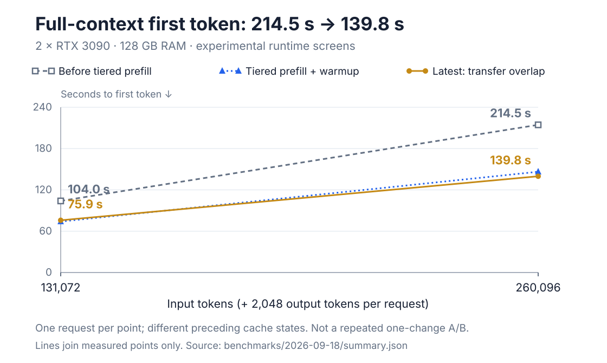

# Qwen3.8-Flash-Next on 2× RTX 3090

<h2 align="center">1,860 tok/s prefill · 89.1 tok/s decode</h2>
<p align="center"><strong>262,144-token context · 2× RTX 3090 (24 GB) · 128 GB system memory</strong></p>
<p align="center">Experimental peaks from separate requests: prefill at 260,096 input tokens; decode after 131,072 input tokens. Each generates 2,048 tokens.</p>
<p align="center"><a href="https://huggingface.co/albucino/Qwen3.8-Flash-Next-W4A16-FP8PLE"><strong>Download the checkpoint</strong></a></p>

Qwen3.8-Flash-Next, with its high sparsity and low active param count is a great candidate for CPU offloading under right setup. This build keeps the
full expert set and an FP8 Ngram table in system memory, caches active (LRU) experts on
the GPUs, and uses a small MTP3 drafter to recover decode speed.

The [checkpoint](https://huggingface.co/albucino/Qwen3.8-Flash-Next-W4A16-FP8PLE) combines Intel's AutoRound W4A16 target with FP8 PLE/ngram
tensors, to fit into 128GB memory. The serving code is a pinned vLLM build plus the
patches in this repo.

## New: full-context prefill in 140 seconds

The latest experimental build reads a 260,096-token prompt in **139.8 seconds**
to first token, then generates 2,048 tokens at **86.2 tok/s**. That is
**1,860 input tok/s**, counting the full wait to first token. The complete
request takes 163.6 seconds.

Compared with the earlier screen at the same input length, the wait fell from
214.5 to 139.8 seconds: **about 35% less waiting**, or 75 seconds saved.
These are single screens with different preceding cache states, not a repeated
one-change A/B. Input tok/s here means input tokens divided by time to first
token, not kernel-only prefill.

| Latest candidate | Input + output tokens | First token | Input tok/s | Decode tok/s |
|---|---:|---:|---:|---:|
| 128K prompt | 131,072 + 2,048 | **75.9 s** | **1,727** | **89.1** |
| Full 256K window | 260,096 + 2,048 | **139.8 s** | **1,860** | **86.2** |



The main change is how large prefills read the GPU/host expert pool. Further
work warms uncommon kernel shapes before serving and overlaps part of the cold
expert transfer with compute. The target weights, BF16 KV, FP8 PLE, ten-expert
routing and approximate QSA budget stay unchanged.

A completed fresh-agent smoke on the **preceding candidate** measured
**1,478 new-token/s prefill** and **79.4 tok/s decode**, with **75% prefix reuse**
across 13 requests. It passed that task; this is not a new 15-task suite score.

**These runtime changes are experimental and are not in the default launcher
or a published image yet.** This update publishes the measurements, not a new
runtime or checkpoint. See the [results, curves and test conditions](benchmarks/2026-09-18/README.md).

## Historical results: 1,402 prefill · 135.2 warm decode

| Workload | Shape | Speed |
|---|---:|---:|
| Prefill | 65,536 input tokens | **1,402 prompt tok/s** |
| Full-context prefill | 262,016 input + 128 output | **1,275.6 prompt tok/s** |
| Warm decode | 128 input + 4,096 output | **135.2 output tok/s** |
| Warm decode, repeated | 128 input + 4,096 output | **127.1–134.0 output tok/s** |
| Decode after a 262K prompt | 262,016 input + 128 output | **54.5 output tok/s** |
| Longest tested sequence | Input + output | **262,144 tokens** |

These are single-request measurements. Prefill and decode use different test
shapes; 1,402 and 135.2 tok/s did not come from the same request. The chart marks
the switch from a 256-token decode test to a 4,096-token test with a dotted line.

The benchmark machine has 8×16 GB DDR4-3200, with all eight memory channels
populated. See the [hardware details](docs/hardware.md#september-5-benchmark-host).


## Speed hillclimb

In the blue series, every point uses 128 input tokens and
256 output tokens. Decode rose from 32.83 to 80.08 tok/s on that fixed workload.

1. **BF16 + MTP2 — 32.83 tok/s.** The original vLLM baseline.

2. **Intel W4A16 — 34.71 tok/s (+1.88).** INT4 cut backbone weight traffic.
   Layers that Intel left in BF16 stayed in BF16.

3. **Larger GPU expert set — 41.10 tok/s (+6.39).** More routed experts stayed
   in VRAM, so fewer token steps had to fetch an expert from system memory.

4. **Pinned copies and a host cache — 43.68 tok/s (+2.58).** Pinned memory made
   expert transfers cheaper. Chunk caching reduced the cost of a miss.

5. **Static hot-96 cache — 49.81 tok/s (+6.13).** The 96 busiest experts stayed
   on the GPUs. The stable layout also made CUDA graph capture practical.

6. **Mixed VMM hot-128 — 57.37 tok/s (+7.56).** The hot set grew to 128 experts
   while the complete expert pool remained addressable in system memory.

7. **Fused QSA — 59.97 tok/s (+2.60).** Fusing sparse-attention selection cut
   launch overhead and repeated block-selection work.

8. **Humming + Marlin — 65.46 tok/s (+5.49).** Humming handled the target MoE
   path; Marlin handled the quantized MTP draft.

9. **Dynamic LRU-100 — 78.73 tok/s (+13.27).** A runtime LRU beat the fixed hot
   list because it followed the experts used by the current sequence.

10. **Dynamic LRU-104 — 80.08 tok/s (+1.35).** Four more resident experts gave
    a small final gain. The matched test ended at **2.44×** its baseline speed.

### Why the graph continues past 80 tok/s

The gold points use a longer output, so they are not direct continuations of the
blue comparison. On the warmed 128-input/4,096-output test:

- Target only: 61.32 tok/s
- Fixed MTP3: 119.94 tok/s
- Adaptive MTP3: 135.21 tok/s

The longer run amortizes one-time request overhead. MTP accounts for most of the
remaining gain: the draft proposes several tokens and the target checks them
together. The target still verifies every accepted token.

### What 256K costs

The original 262,016-input boundary probe measured 54.5 tok/s over just 128
output tokens. That short probe does not establish sustained decode speed or
isolate the cost of longer attention. The new experimental result above uses
2,048 output tokens and reaches 86.2 tok/s, so the two tests are not directly
comparable. The historical balanced profile prefills its prompt at 1,275.6 tok/s.
A static expert cache reached
1,629 prompt tok/s, but its decode behavior was worse, so it is not the default.

## Checkpoint layout

| Part | Storage format |
|---|---|
| Target backbone | Intel AutoRound W4A16, symmetric INT4 group-128 |
| Sensitive target layers | Original BF16 |
| 51.2B-parameter PLE table | FP8 E4M3FN with the published scale |
| MTP routed experts | Symmetric INT4 group-32 |
| Other MTP tensors | Original source precision |
| KV cache | BF16 |

The target payload is 116.183 GiB. The compact MTP draft adds 3.855 GiB. Most of
the surprising size comes from the PLE table and the tensors that remain BF16,
not from an unquantized backbone.

## Run it

You need Linux, Docker, NVIDIA Container Toolkit, two 24 GB RTX 3090 cards, and
128 GB of system memory. Configure at least 32 GiB of swap on fast NVMe before
the first launch; 48–64 GiB is safer. The loader can exceed physical RAM even
though steady serving fits much more comfortably.

Download the pinned checkpoint revision:

```bash
hf download albucino/Qwen3.8-Flash-Next-W4A16-FP8PLE \
  --revision ef554143369a706525336f6b42a09094835dc077 \
  --local-dir /models/qwen38-flash-next
```

Build and start the server:

```bash
git clone https://github.com/DominikBucko/qwen38-flash-next-2x3090.git
cd qwen38-flash-next-2x3090

cp .env.example .env
# Set MODEL_DIR in .env.

make build-image
make preflight
make serve
```

The OpenAI-compatible endpoint is `http://127.0.0.1:8000/v1`.

Image inputs are optional. See the [vision profile and request example](docs/vision.md).

The default now caches 84 experts per layer to leave more room for prefill.
Context stays at 256K and precision is unchanged. The original hillclimb results
are historical; the new experimental results use additional, unreleased changes.
Neither is a speed guarantee for this launcher. Set `VLLM_WNA16_STATIC_HOT_CACHE_SIZE=88`
in `.env` to try the tighter profile. Existing `.env` files keep their old value.

### If it runs out of memory

Even hot84 can be tight with other GPU users. Check `free -h`,
`swapon --show`, and `nvidia-smi` first. Then make one change at a time:

1. Check that `VLLM_WNA16_STATIC_HOT_CACHE_SIZE=84`; an older `.env` may still
   select `88`. If needed, try `80`. Each removed slot saves roughly 116 MiB
   per GPU across the 48 layers, at the cost of more expert traffic from system memory.
2. Lower `KV_CACHE_MEMORY_BYTES` from `4429185024` to `4294967296`. Keep this
   only if the startup log still reports at least 262,144 KV-cache tokens.
3. Lower `MAX_NUM_BATCHED_TOKENS` from `4096` to `2048`. This reduces peak
   prefill temporaries but also reduces prefill throughput.

Changing `MAX_MODEL_LEN` alone does not release the explicitly reserved KV
allocation. For the full explanation, including two-client sizing, see
[`docs/memory.md`](docs/memory.md).

## Rebuild the checkpoint

The build scripts pin every upstream commit. They copy Intel's target tensors
without another quantization or packing pass.

```bash
./scripts/download_sources.sh /models/qwen38-sources
make build-image
./scripts/assemble_with_docker.sh /models/qwen38-sources upload
```

The assembled HF tree is written to `/models/qwen38-sources/upload`. See
[`docs/reproduce.md`](docs/reproduce.md) for source revisions, validation, and
upload commands.

## Data and caveats

The small JSON summaries are public:

- [September 18 experimental long-context and fresh-agent results](benchmarks/2026-09-18/summary.json)
- [`benchmarks/serving-summary.json`](benchmarks/serving-summary.json)
- [`benchmarks/hillclimb.json`](benchmarks/hillclimb.json)
- [`benchmarks/agentbench-summary.json`](benchmarks/agentbench-summary.json)

Private AgentBench fixtures, hidden tests, workspaces, and reasoning traces are
not included. The default uses approximate QSA. Exact QSA is available as a
slower comparison profile.

## License

The runtime code is Apache-2.0. The model keeps the upstream Qwen and third-party
terms listed in [`THIRD_PARTY_NOTICES.md`](THIRD_PARTY_NOTICES.md).
