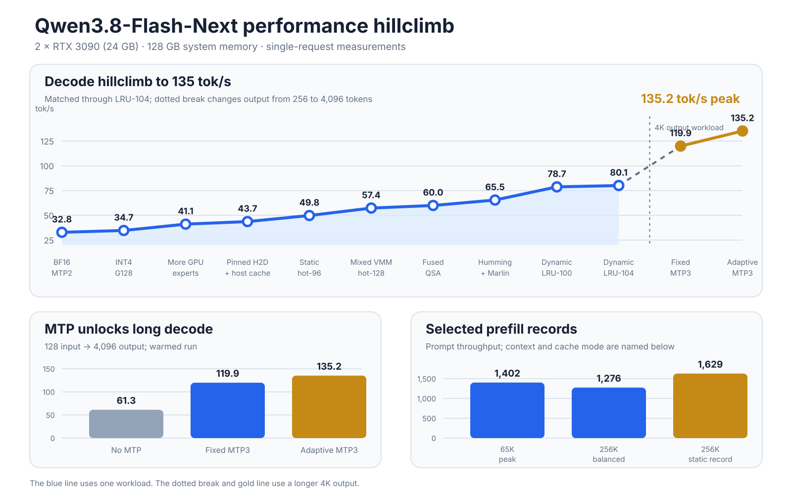

# Qwen3.8-Flash-Next on 2× RTX 3090

<h2 align="center">1,402 tok/s prefill · 135.2 tok/s decode</h2>
<p align="center"><strong>262,144-token context · 2× RTX 3090 (24 GB) · 128 GB system memory</strong></p>

This repository runs Qwen3.8-Flash-Next at its full context length on two RTX
3090 cards. The target uses Intel AutoRound W4A16 weights. The 51.2B-parameter
n-gram table uses FP8. A compact INT4 MTP3 draft increases decode speed.

## Results

| Test | Context | Result |
|---|---:|---:|
| Peak prefill | 65,536 input tokens | **1,402 prompt tok/s** |
| Full-context prefill | 262,016 input + 128 output | **1,275.6 prompt tok/s** |
| Peak warmed decode | 128 input + 4,096 output | **135.2 output tok/s** |
| Compact MTP repeat | 128 input + 4,096 output | **127.1–134.0 output tok/s** |
| Decode after the 262K prompt | 262,016 input + 128 output | **54.5 output tok/s** |
| Maximum tested sequence | Input + output | **262,144 tokens** |

These are single-request results. Prefill and decode use different test shapes.
The dotted break in the chart marks the change from 256 to 4,096 output tokens.
Do not read 1,402 and 135.2 as results from one request.



## The hillclimb

The matched decode test used ten requests. Each request had 128 input tokens and
256 output tokens. The result is the reciprocal of mean time per output token.
This test improved from 32.8 to 80.1 tok/s. The workload stayed the same through
all ten steps.

1. **BF16 + MTP2: 32.83 tok/s.** This was the first vLLM baseline. It used the
   BF16 backbone and a two-token MTP draft.

2. **INT4 group-128: 34.71 tok/s.** The INT4 backbone reduced active weight
   traffic. Sensitive layers kept their source precision. Gain: 1.88 tok/s.

3. **More experts on the GPUs: 41.10 tok/s.** More routed experts stayed in GPU
   memory. This reduced reads from system memory. Gain: 6.39 tok/s.

4. **Pinned transfers and a host cache: 43.68 tok/s.** Pinned memory reduced
   transfer cost. A chunked cache reduced the cost of an expert miss. Gain:
   2.58 tok/s.

5. **Static hot-96 cache: 49.81 tok/s.** The 96 most common experts stayed on
   the GPUs. CUDA graphs captured this stable path. Gain: 6.13 tok/s.

6. **Mixed VMM hot-128: 57.37 tok/s.** The GPUs kept 128 hot experts. The full
   expert set stayed available in system memory. Gain: 7.56 tok/s.

7. **Fused QSA: 59.97 tok/s.** The fused sparse-attention path reduced kernel
   launch and block-selection work. Gain: 2.60 tok/s.

8. **Humming + Marlin: 65.46 tok/s.** Humming ran the target MoE path. Marlin
   ran the quantized MTP draft. Gain: 5.49 tok/s.

9. **Dynamic LRU-100: 78.73 tok/s.** A runtime LRU replaced the fixed expert
   list. The cache adapted to the current token stream. Gain: 13.27 tok/s.

10. **Dynamic LRU-104: 80.08 tok/s.** Four more experts stayed resident. Gain:
    1.35 tok/s. Total gain from the baseline: **2.44×**.

### MTP changed the long-decode result

The long test used one warmed request with 128 input tokens and 4,096 output
tokens.

- Target-only decode reached 61.32 tok/s.
- Fixed MTP3 reached 119.94 tok/s. This was a 95.6% gain.
- Adaptive MTP3 reached 135.21 tok/s. This added another 12.7%.

The MTP draft proposes tokens. The target model checks each proposal. The draft
changes speed and acceptance. It does not replace target verification.

### Full context changed the balance

The 256K test needs more KV and attention work. The balanced profile reached
1,275.6 prompt tok/s at 262,016 input tokens. Decode after this prompt reached
54.5 tok/s. A static expert cache reached 1,629 prompt tok/s at the same boundary,
but it was not the best balanced decode profile.

## Model layout

| Part | Format |
|---|---|
| Target backbone | Intel AutoRound W4A16, symmetric INT4 group-128 |
| Sensitive target layers | BF16, unchanged |
| 51.2B n-gram/PLE table | FP8 E4M3FN with the published scale |
| MTP routed experts | INT4, symmetric group-32 |
| Other MTP tensors | Source precision, unchanged |
| KV cache | BF16 |

The target payload is 116.183 GiB. The compact MTP draft adds 3.855 GiB. The
large size comes mainly from the FP8 n-gram table and the layers that stay in
BF16. The target backbone is still W4A16.

## Run the model

Requirements:

- Linux x86_64
- 2× RTX 3090 with 24 GB on each card
- 128 GB system memory
- Docker and NVIDIA Container Toolkit
- the published Hugging Face checkpoint

Download the exact model revision after it is published:

```bash
hf download OWNER/MODEL \
  --revision FULL_HUGGING_FACE_COMMIT \
  --local-dir /models/qwen38-flash-next
```

Start the server:

```bash
git clone https://github.com/DominikBucko/qwen38-flash-next-2x3090.git
cd qwen38-flash-next-2x3090

cp .env.example .env
# Set MODEL_DIR in .env.

make build-image
make preflight
make serve
```

The OpenAI-compatible API listens on `http://127.0.0.1:8000/v1`.

## Build the checkpoint from source

The build uses full commit IDs. It does not quantize or repack Intel target
tensors.

```bash
./scripts/download_sources.sh /models/qwen38-sources
make build-image
./scripts/assemble_with_docker.sh /models/qwen38-sources upload
```

The result is `/models/qwen38-sources/upload`. Read
[`docs/reproduce.md`](docs/reproduce.md) for the full procedure.

## Publish the checkpoint to Hugging Face

Create a Hugging Face account and a write token. Do not put the token in this
repository. Install the `hf` CLI on the machine that stores the 121 GB model:

```bash
curl -LsSf https://hf.co/cli/install.sh | bash -s
hf auth login
hf auth whoami
```

Then run:

```bash
./scripts/upload_hf.sh YOUR_HF_NAME/Qwen3.8-Flash-Next-W4A16-FP8PLE \
  /path/to/the/upload-tree
```

The upload uses Hugging Face Xet. You can run the command again after an
interruption. After the upload, put the returned model commit in
[`repro.lock.json`](repro.lock.json).

## Benchmark notes

The repository contains small result summaries. It does not contain private
AgentBench tasks, hidden tests, oracle code, raw workspaces, or raw reasoning
traces.

- [`benchmarks/serving-summary.json`](benchmarks/serving-summary.json)
- [`benchmarks/hillclimb.json`](benchmarks/hillclimb.json)
- [`benchmarks/agentbench-summary.json`](benchmarks/agentbench-summary.json)

## License

The runtime code uses Apache-2.0. The model weights are not part of this GitHub
repository. The model keeps its upstream Qwen and third-party terms. Read
[`THIRD_PARTY_NOTICES.md`](THIRD_PARTY_NOTICES.md).
