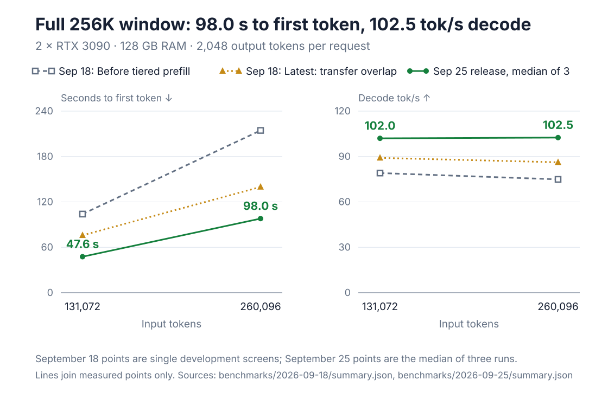
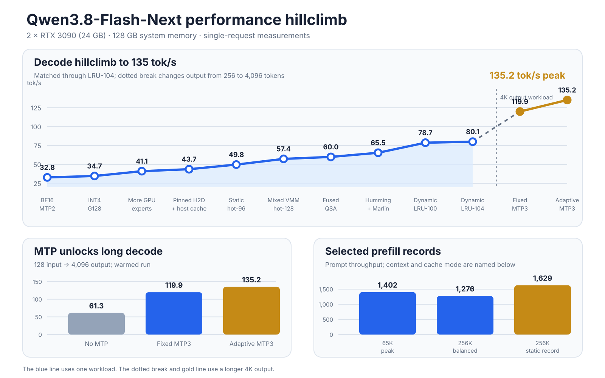

# Qwen3.8-Flash-Next on 2× RTX 3090

<h2 align="center">Up to 4,191 tok/s prefill · up to 111.5 tok/s decode</h2>
<p align="center"><strong>Up to 262,144-token context · 2× RTX 3090 (24 GB) · 128 GB system memory</strong></p>
<p align="center">One request: 131,072 input tokens, then 2,048 output tokens, best of 2. Prefill with the new <a href="configs/agent-128k-prefill.env">prefill profile</a> (31.3 s to first token), decode with the <a href="configs/agent-128k.env">agent 128K profile</a>. The <a href="configs/fast-256k.env">fast 256K profile</a> reads a full 260,096-token window in 90.8 s (2,865 input tok/s).</p>
<p align="center"><a href="https://huggingface.co/albucino/Qwen3.8-Flash-Next-W4A16-FP8PLE"><strong>Download the checkpoint</strong></a></p>

> **Only 64 GB of RAM?** The new [64 GB profile](#new-64-gb-ram-profile) runs the same two cards with half the
> memory: **3,410 tok/s prefill and 84 tok/s decode** on a 131,072-token prompt.
>
> **Only one GPU?** [qwen38-flash-next-3090](https://github.com/DominikBucko/qwen38-flash-next-3090) runs the
> same checkpoint on a **single RTX 3090 with 64 GB of RAM**: up to 2,100 tok/s prefill, 43–51 tok/s decode,
> 128K context.

Qwen3.8-Flash-Next, with its high sparsity and low active param count is a great candidate for CPU offloading under right setup. This build keeps the
full expert set and an FP8 Ngram table in system memory, caches active (LRU) experts on
the GPUs, and uses a small MTP3 drafter to recover decode speed.

The [checkpoint](https://huggingface.co/albucino/Qwen3.8-Flash-Next-W4A16-FP8PLE) combines Intel's AutoRound W4A16 target with FP8 PLE/ngram
tensors, to fit into 128GB memory. The serving code is a pinned vLLM build plus the
patches in this repo.

## New: prefill profile

[`configs/agent-128k-prefill.env`](configs/agent-128k-prefill.env) is the agent 128K profile with 8,192-token
prefill chunks instead of 4,096. Every chunk streams all cold experts over PCIe once, so bigger chunks halve that
traffic on long prompts. The VRAM they need comes from the expert cache: 88 instead of 100 experts per layer and
GPU (with 100, 8K chunks run out of VRAM), so decode pulls more experts from system memory. Same image, same day,
two runs each:

| Profile | 131K + 2K: first token | Input tok/s | Decode tok/s | 8K + 2K: input tok/s | Decode tok/s |
|---|---:|---:|---:|---:|---:|
| **Prefill** (8K chunks, hot88) | **31.3–36.0 s** | **3,643–4,191** | 91.9–101.8 | **3,844–3,851** | 98.9–101.1 |
| Agent 128K (4K chunks, hot100) | 43.1–47.6 s | 2,756–3,045 | **104.8–111.5** | 2,822–2,823 | **103.2–106.2** |

The slower 131K run of each profile is the first request after a start. Choose the prefill profile when long
prompts dominate the wait, and the agent profile when long outputs do. Both limit requests to 135,168 tokens, one
at a time, and need the same host as the fast 256K profile. Enable it with:

```bash
cat configs/agent-128k-prefill.env >> .env
make serve
```

See the [prefill profile results](benchmarks/2026-09-30/README.md#prefill-profile-for-128-gb-machines).

## New: 64 GB RAM profile

[`configs/2x3090-64gb.env`](configs/2x3090-64gb.env) serves the model on two RTX 3090s with **64 GB of system
RAM** and a 128K context. The 128 GB profiles keep a pinned copy of every expert (~58 GiB) and the PLE table
(~48 GiB) in RAM. Here each GPU owns its 88 most-used experts per layer outright, and the other experts of its
half live once in RAM (38 GiB for both GPUs). During decode a CPU thread pool per GPU computes them, with the GPU
taking a share over PCIe; prefill streams them to the GPUs. The FP8 PLE table is read in place from the
checkpoint on NVMe.

| 2× RTX 3090, machine limited to 64 GB RAM | First token | Prefill | Decode |
|---|---:|---:|---:|
| 131,099 + 512 tokens | 38.4–38.5 s | **3,401–3,413 tok/s** | **84.2–88.8 tok/s** |
| 32,799 + 512 | 10.2–10.3 s | 3,200–3,211 tok/s | 77.0–83.9 tok/s |
| 8,218 + 1,024 | 2.6 s | 3,114–3,146 tok/s | 78.2–79.7 tok/s |
| 131,099 + 512, 12 CPU cores (Ryzen 9 9900X layout) | 38.4 s | 3,413 tok/s | 80.7 tok/s |

Prefill is faster than with the 128 GB agent profile only because of the larger prefill chunks. Every chunk streams
all of a GPU's cold experts once, and keeping 88 instead of 100 experts per layer on each GPU leaves the VRAM for
8,192-token chunks instead of 4,096. With 4,096 this profile prefills 131K at 2,754 tok/s, a little below the agent
profile; the [prefill profile](#new-prefill-profile) gives the 128 GB machines the same 8K chunks. Decode is about a
quarter slower and depends on CPU memory bandwidth. Requests are limited to 135,168
tokens, one at a time. CUDA P2P is not needed. Enable it with:

```bash
cat configs/2x3090-64gb.env >> .env
make serve
```

No swap is needed. The container gets the installed RAM minus 8 GiB and sizes its expert arenas from that. See
the [64 GB section of the memory guide](docs/memory.md#64-gb-ram-the-2x3090-64gb-profile) and the
[benchmark report](benchmarks/2026-09-30/README.md). The benchmark host runs both cards at PCIe ×16; desktop
boards often split them ×8/×8 (untested, see the report).

## September 29 runtime (v0.4.0)

**Long prompts are 6–8% faster to first token.** On async-scheduled profiles, the
KV cache leaked one recurrent-state block per prefill chunk in each Mamba layer
group, so long requests filled the pool and were preempted several times. With
the fix, the fast 256K profile runs with no preemptions:

| Fast 256K profile, release image, 3 runs | September 25 | September 29 |
|---|---:|---:|
| 131,072 + 2,048: first token | 47.6–48.7 s | **45.0–46.0 s** |
| 131,072 + 2,048: input tok/s | 2,693–2,757 | **2,852–2,916** |
| 260,096 + 2,048: first token | 98.0 s | **90.8 s** |
| 260,096 + 2,048: input tok/s | 2,653–2,654 | **2,864–2,865** |

Decode, 8K prefill, 256K needle retrieval and prefix-cache reuse are unchanged.
See the [same-night A/B and validation](benchmarks/2026-09-28/README.md).

**New agent 128K profile.** [`configs/agent-128k.env`](configs/agent-128k.env)
halves the context window and spends the freed KV memory on 16 more hot experts
per GPU. Decode then pulls fewer experts from system memory:

| Agent 128K profile, release image | First token | Input tok/s | Decode tok/s |
|---|---:|---:|---:|
| 131,072 + 2,048, best of 2 | **43.3 s** | **3,029** | **109.8** |
| 7-prompt decode set (8K–131K) | | | 116.1 (fast 256K: 104–105) |

Requests are limited to 135,168 tokens in total. See the
[agent profile results and limits](benchmarks/2026-09-29/README.md).

## September 25: fast 256K runtime

The September 25 runtime reads a **131,072-token prompt in 47.6 seconds** to
first token (**2,752 input tok/s**), then generates 2,048 tokens at
**104.5 tok/s**. Both numbers come from the same request on the release image.

| Fast 256K profile | Input + output tokens | First token | Input tok/s | Decode tok/s |
|---|---:|---:|---:|---:|
| 128K prompt, release image, best of 3 | 131,072 + 2,048 | **47.6 s** | **2,752** | **104.5** |
| 128K prompt, release image, 3 runs | 131,072 + 2,048 | 47.6–48.7 s | 2,693–2,757 | 94.2–104.5 |
| Full 256K window, release image, best of 3 | 260,096 + 2,048 | **98.0 s** | **2,654** | **103.1** |
| Full 256K window, release image, 3 runs | 260,096 + 2,048 | 98.0 s | 2,653–2,654 | 92.6–103.1 |

Compared with the September 18 build on the same prompt, the full-window wait
fell from 147.0 to 98.0 seconds, and decode rose from 82.6 to 100+ tok/s.



What changed:

- **Streamed prefill staging.** Each layer's cold experts are copied to the GPU
  by DMA one or two layers ahead of large prefill chunks, then the unchanged
  expert GEMM runs from VRAM.
- **No host stalls between steps**, so async scheduling now overlaps input
  preparation with GPU work.
- **P2P all-reduce**, a **skinny GEMM kernel** for decode, and a **smaller MTP
  draft vocabulary**. The target still verifies every token.
- The whole **PLE table stays in RAM**, and kernel caches persist between starts.

Weights, BF16 KV, FP8 PLE, ten-expert routing and the approximate QSA budget
are unchanged. Nothing is pruned.

**Decode speed depends on free RAM.** The runtime keeps about 60 GB of expert
weights and the 51.2 GB PLE table in system memory. With another job filling
RAM, the same profile gave 91–95 tok/s at full context. See the
[results, conditions and limits](benchmarks/2026-09-25/README.md).

The previous build's measurements are in [September 18 results](benchmarks/2026-09-18/README.md).

## Historical results: 1,402 prefill · 135.2 warm decode

| Workload | Shape | Speed |
|---|---:|---:|
| Prefill | 65,536 input tokens | **1,402 prompt tok/s** |
| Full-context prefill | 262,016 input + 128 output | **1,275.6 prompt tok/s** |
| Warm decode | 128 input + 4,096 output | **135.2 output tok/s** |
| Warm decode, repeated | 128 input + 4,096 output | **127.1–134.0 output tok/s** |
| Decode after a 262K prompt | 262,016 input + 128 output | **54.5 output tok/s** |
| Longest tested sequence | Input + output | **262,144 tokens** |

These are single-request measurements. Prefill and decode use different test
shapes; 1,402 and 135.2 tok/s did not come from the same request. The chart marks
the switch from a 256-token decode test to a 4,096-token test with a dotted line.

The benchmark machine has 8×16 GB DDR4-3200, with all eight memory channels
populated. See the [hardware details](docs/hardware.md#september-5-benchmark-host).



## Speed hillclimb

In the blue series, every point uses 128 input tokens and
256 output tokens. Decode rose from 32.83 to 80.08 tok/s on that fixed workload.

1. **BF16 + MTP2 — 32.83 tok/s.** The original vLLM baseline.

2. **Intel W4A16 — 34.71 tok/s (+1.88).** INT4 cut backbone weight traffic.
   Layers that Intel left in BF16 stayed in BF16.

3. **Larger GPU expert set — 41.10 tok/s (+6.39).** More routed experts stayed
   in VRAM, so fewer token steps had to fetch an expert from system memory.

4. **Pinned copies and a host cache — 43.68 tok/s (+2.58).** Pinned memory made
   expert transfers cheaper. Chunk caching reduced the cost of a miss.

5. **Static hot-96 cache — 49.81 tok/s (+6.13).** The 96 busiest experts stayed
   on the GPUs. The stable layout also made CUDA graph capture practical.

6. **Mixed VMM hot-128 — 57.37 tok/s (+7.56).** The hot set grew to 128 experts
   while the complete expert pool remained addressable in system memory.

7. **Fused QSA — 59.97 tok/s (+2.60).** Fusing sparse-attention selection cut
   launch overhead and repeated block-selection work.

8. **Humming + Marlin — 65.46 tok/s (+5.49).** Humming handled the target MoE
   path; Marlin handled the quantized MTP draft.

9. **Dynamic LRU-100 — 78.73 tok/s (+13.27).** A runtime LRU beat the fixed hot
   list because it followed the experts used by the current sequence.

10. **Dynamic LRU-104 — 80.08 tok/s (+1.35).** Four more resident experts gave
    a small final gain. The matched test ended at **2.44×** its baseline speed.

### Why the graph continues past 80 tok/s

The gold points use a longer output, so they are not direct continuations of the
blue comparison. On the warmed 128-input/4,096-output test:

- Target only: 61.32 tok/s
- Fixed MTP3: 119.94 tok/s
- Adaptive MTP3: 135.21 tok/s

The longer run amortizes one-time request overhead. MTP accounts for most of the
remaining gain: the draft proposes several tokens and the target checks them
together. The target still verifies every accepted token.

### What 256K costs

The original 262,016-input boundary probe measured 54.5 tok/s over just 128
output tokens. That short probe does not establish sustained decode speed or
isolate the cost of longer attention. The new experimental result above uses
2,048 output tokens and reaches 86.2 tok/s, so the two tests are not directly
comparable. The historical balanced profile prefills its prompt at 1,275.6 tok/s.
A static expert cache reached
1,629 prompt tok/s, but its decode behavior was worse, so it is not the default.

## Checkpoint layout

| Part | Storage format |
|---|---|
| Target backbone | Intel AutoRound W4A16, symmetric INT4 group-128 |
| Sensitive target layers | Original BF16 |
| 51.2B-parameter PLE table | FP8 E4M3FN with the published scale |
| MTP routed experts | Symmetric INT4 group-32 |
| Other MTP tensors | Original source precision |
| KV cache | BF16 |

The target payload is 116.183 GiB. The compact MTP draft adds 3.855 GiB. Most of
the surprising size comes from the PLE table and the tensors that remain BF16,
not from an unquantized backbone.

## Run it

You need Linux, Docker, NVIDIA Container Toolkit, two 24 GB RTX 3090 cards, and
128 GB of system memory. Configure at least 32 GiB of swap on fast NVMe before
the first launch; 48–64 GiB is safer. The loader can exceed physical RAM even
though steady serving fits much more comfortably.

Download the pinned checkpoint revision:

```bash
hf download albucino/Qwen3.8-Flash-Next-W4A16-FP8PLE \
  --revision ef554143369a706525336f6b42a09094835dc077 \
  --local-dir /models/qwen38-flash-next
```

Build and start the server:

```bash
git clone https://github.com/DominikBucko/qwen38-flash-next-2x3090.git
cd qwen38-flash-next-2x3090

cp .env.example .env
# Set MODEL_DIR in .env.

make build-image
make preflight
make serve
```

The OpenAI-compatible endpoint is `http://127.0.0.1:8000/v1`.

To skip the local build, pull the published release image (weights stay a
separate download) and pin it by the digest from the release notes:
`IMAGE=ghcr.io/dominikbucko/qwen38-flash-next-2x3090@sha256:<digest> make serve`.
See [Prebuilt image](docs/reproduce.md#prebuilt-image).

For the fast 256K profile, append [`configs/fast-256k.env`](configs/fast-256k.env)
to `.env` before `make serve`. It needs working bidirectional CUDA P2P between
the two cards (see the [P2P check](docs/performance.md#cuda-p2p-and-custom-all-reduce)) and
enough free RAM to keep the PLE table resident, so stop other memory-heavy jobs:

```bash
cat configs/fast-256k.env >> .env
make serve
```

For agent work that stays under 128K, use [`configs/agent-128k.env`](configs/agent-128k.env)
instead. It has the same requirements. The context is 135,168 tokens, and the
KV memory this frees holds 16 more hot experts per GPU: about 110 tok/s decode
and 3,000 input tok/s on a 131,072-token prompt ([results](benchmarks/2026-09-29/README.md)).
[`configs/agent-128k-prefill.env`](configs/agent-128k-prefill.env) trades some of that decode for up to 4,191
input tok/s ([results](benchmarks/2026-09-30/README.md#prefill-profile-for-128-gb-machines)).

Image inputs are optional. See the [vision profile and request example](docs/vision.md).

The default now caches 84 experts per layer to leave more room for prefill.
Context stays at 256K and precision is unchanged. The original hillclimb results
are historical. None of the results is a speed guarantee for your host. Set `VLLM_WNA16_STATIC_HOT_CACHE_SIZE=88`
in `.env` to try the tighter profile. Existing `.env` files keep their old value.

### If it runs out of memory

Even hot84 can be tight with other GPU users. Check `free -h`,
`swapon --show`, and `nvidia-smi` first. Then make one change at a time:

1. Check that `VLLM_WNA16_STATIC_HOT_CACHE_SIZE=84`; an older `.env` may still
   select `88`. If needed, try `80`. Each removed slot saves roughly 116 MiB
   per GPU across the 48 layers, at the cost of more expert traffic from system memory.
2. Lower `KV_CACHE_MEMORY_BYTES` from `4429185024` to `4294967296`. Keep this
   only if the startup log still reports at least 262,144 KV-cache tokens.
3. Lower `MAX_NUM_BATCHED_TOKENS` from `4096` to `2048`. This reduces peak
   prefill temporaries but also reduces prefill throughput.

Changing `MAX_MODEL_LEN` alone does not release the explicitly reserved KV
allocation. For the full explanation, including two-client sizing, see
[`docs/memory.md`](docs/memory.md).

## Rebuild the checkpoint

The build scripts pin every upstream commit. They copy Intel's target tensors
without another quantization or packing pass.

```bash
./scripts/download_sources.sh /models/qwen38-sources
make build-image
./scripts/assemble_with_docker.sh /models/qwen38-sources upload
```

The assembled HF tree is written to `/models/qwen38-sources/upload`. See
[`docs/reproduce.md`](docs/reproduce.md) for source revisions, validation, and
upload commands.

## Data and caveats

The small JSON summaries are public:

- [September 30 prefill and 64 GB profile results](benchmarks/2026-09-30/summary.json)
- [September 29 agent 128K profile results](benchmarks/2026-09-29/summary.json)
- [September 28 state-block fix A/B and validation](benchmarks/2026-09-28/summary.json)
- [September 25 fast 256K runtime results](benchmarks/2026-09-25/summary.json)
- [September 18 experimental long-context and fresh-agent results](benchmarks/2026-09-18/summary.json)
- [`benchmarks/serving-summary.json`](benchmarks/serving-summary.json)
- [`benchmarks/hillclimb.json`](benchmarks/hillclimb.json)
- [`benchmarks/agentbench-summary.json`](benchmarks/agentbench-summary.json)

Private AgentBench fixtures, hidden tests, workspaces, and reasoning traces are
not included. The default uses approximate QSA. Exact QSA is available as a
slower comparison profile.

## License

The runtime code is Apache-2.0. The model keeps the upstream Qwen and third-party
terms listed in [`THIRD_PARTY_NOTICES.md`](THIRD_PARTY_NOTICES.md).
