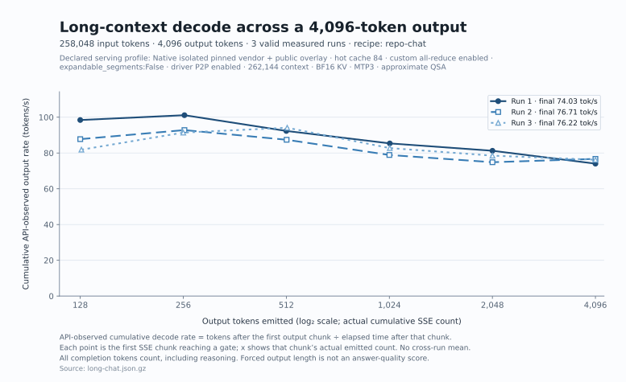

# Benchmark evidence

## September 5 verified public measurements

The public [`benchmarks/2026-09-05`](../benchmarks/2026-09-05/README.md)
bundle contains the request manifests, per-run reports, server and hardware
facts, output-capture reviews, and a
[machine-readable summary](../benchmarks/2026-09-05/summary.json). The candidate
used 2× RTX 3090, an 84-expert hot cache, CUDA P2P in both directions, custom
all-reduce enabled, and
`PYTORCH_CUDA_ALLOC_CONF=expandable_segments:False`.

| Public recipe | Shape and run policy | API-observed output speed | TTFT |
|---|---|---:|---:|
| `repo-chat` long | 258,048 input + 4,096 output; 3 measured, no explicit warmup | **75.636 tok/s aggregate** (74.031–76.707) | 211.059–215.128 s |
| `repo-chat` short | 128 input + 4,096 output; 1 warmup + 3 measured | **77.2845 tok/s aggregate** (74.746–79.707) | 0.897–0.903 s |

The long-run rates were 74.030749, 76.707158, and 76.224624 tok/s, producing a
75.6360734 tok/s reciprocal-mean aggregate. Their TTFT values were 215.128,
211.059, and 211.228 seconds. All 27 weight files
matched the published SHA-256 manifest for canonical revision
`ef554143369a706525336f6b42a09094835dc077`. The experiment used a clean pinned
vendor vLLM plus public overlay with existing native dependencies; it was not a
fresh Docker build. Four recoverable allocator warnings appeared during the
first long prefill, but all three measured streams completed with exact API
usage counts.

The client forces the output length. Completion-token counts include reasoning
and control tokens, and captures can stop during reasoning rather than at a
finished answer. These are serving probes, not answer-quality evaluations.

A separate `repo-code` raw-continuation diagnostic used hot-cache 86, custom
all-reduce disabled, and expandable segments enabled. Its 258,048 + 4,096
three-run aggregate was 78.8238 tok/s. The prompt recipe and runtime profile
differ from the chat candidate, so this is neither a promotional result nor a
controlled custom-all-reduce speed comparison.

## Historical isolated serving measurements

The sanitized machine-readable results are in
[`benchmarks/serving-summary.json`](../benchmarks/serving-summary.json).

The full-context request used 262,016 input tokens and 128 output tokens, exactly
reaching the model's 262,144-token limit. Prefill was 1,275.6 token/s, TTFT was
205.4 seconds, and decode after that prompt was 54.5 token/s. Two warmed
128-input/4,096-output greedy probes with the compact MTP draft produced 134.0
and 127.1 output token/s.

The 128-output boundary probe establishes capacity. Its generation window is
too short to characterize sustained long-context output speed. Use the public
[measurement client and longer-output protocol](performance.md#collect-reproducible-measurements-on-your-machine)
for that question, keeping its workload and runtime conditions separate from
these historical measurements.

These are single-request probes. Prompt accounting from an agent harness is not
a substitute for isolated prefill or decode timing because repeated context,
prefix-cache hits, tool turns, and non-streaming response time are mixed.

## LBX AgentBench v0.2

[`benchmarks/agentbench-summary.json`](../benchmarks/agentbench-summary.json)
contains sanitized aggregate results only. The main Intel hybrid run used xhigh
reasoning, 32 steps, a 16,384-token per-response ceiling, and one trajectory per
task. It achieved 9/15 strict passes, 11/15 full private-suite passes, and a
97.601 mean score.

The exact-versus-approximate QSA A/B used a cache-fixed harness and one
trajectory per mode. Exact QSA improved strict workflow completion but had one
fewer hidden-functional pass and a 0.445 lower mean score, so approximate remains
the default. The evidence is directional, not statistically conclusive; the
benchmark protocol calls for three fresh trajectories per configuration before
making a strong quality claim.

Private fixtures, hidden assertions, oracle code, raw reasoning traces, final
workspaces, and task patches are deliberately excluded. Publishing them would
contaminate future evaluations. The retained internal archive should remain
private and is identified only by hashes/configuration metadata in release
notes.

## Reproduction record

Record the driver, container digest, server flags, context length, request
shape, and warmup state with every published run. Use the same request shape
when you compare two runtime changes.
